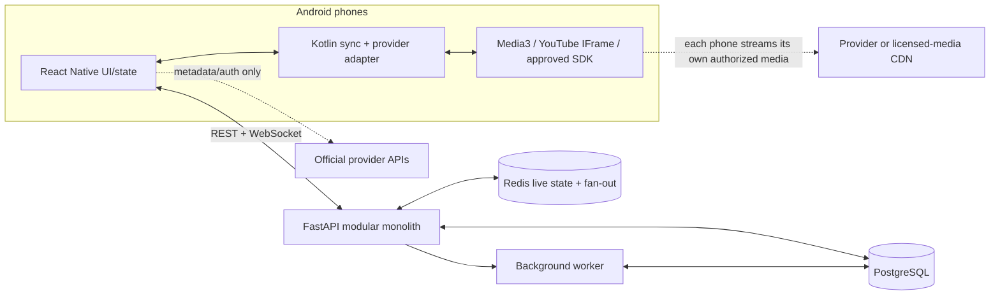
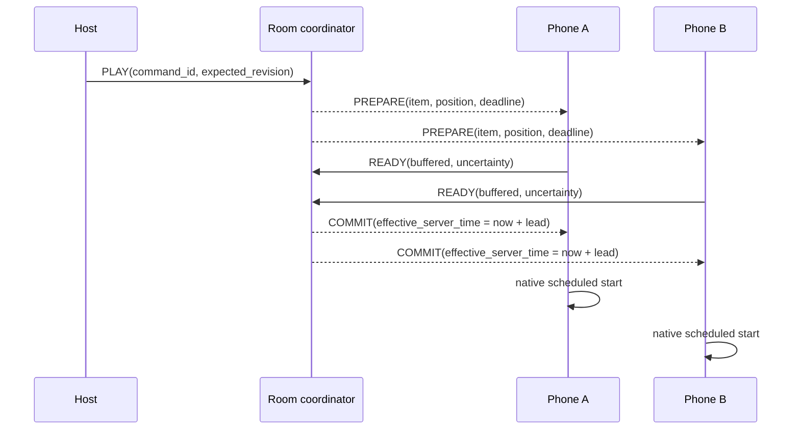

# System design

## Design principles

- The backend is a **control plane**, never an audio proxy.
- A room has one provider and one canonical, revisioned playback timeline.
- Commands are ordered and idempotent; presence and telemetry may be lossy.
- Playback details live behind provider adapters.
- Time-critical scheduling and measurement run natively, not on the React Native JavaScript timer.
- Start as a modular monolith. Split services only after measurements show a need.

## Recommended technology

| Area | Choice | Reason |
|---|---|---|
| Android UI/product logic | React Native + TypeScript | Matches existing React/TS knowledge and preserves substantial Windows/UI reuse |
| Android playback/timing | Kotlin Turbo Native Module | Provider SDKs, Media3, monotonic scheduling, lifecycle, and audio focus belong on the native side |
| Client state | Zustand or Redux Toolkit, one choice only | Deterministic room reducer; easy event replay/debugging |
| REST + realtime | FastAPI, Pydantic, WebSockets | Matches Python knowledge; one deployable codebase is enough for MVP |
| Durable store | PostgreSQL | Users, rooms, membership, queue, chat, moderation, audit records |
| Live state/fan-out | Redis | Presence, expiring room snapshots, rate limits, cross-instance Pub/Sub; Streams for short command replay if needed |
| Background work | Small Python worker | Playlist metadata refresh, notification delivery, cleanup; no Celery until workload requires it |
| Local development | Docker Compose | Reproducible PostgreSQL + Redis |
| Protocol | Versioned JSON envelopes + generated TS/Python validation | Easy inspection and evolution; binary protocols add little at MVP scale |

For controlled audio, use a seek-friendly container such as MP4/AAC rather than variable-bitrate MP3. Android's Media3 documentation notes that exact seeking in VBR MP3 may require scanning/indexing the file, which is a poor fit for late join and drift correction. Preload the current and next item, but cap it to avoid waste.

## High-level topology



## Backend modules

- **Identity:** PocketDisco login, access/refresh tokens, device sessions.
- **Rooms:** lifecycle, privacy, roles, invitations, host transfer.
- **Playback coordinator:** validates commands, increments revision, updates the canonical timeline, publishes events.
- **Queue:** provider-scoped items and ordering.
- **Realtime gateway:** WebSocket connection, subscriptions, acknowledgements, gap recovery.
- **Presence/chat:** ephemeral presence; durable, moderated text messages.
- **Providers:** URL parsing, permitted metadata, OAuth callbacks where needed. It never fetches audio bytes.
- **Safety/operations:** rate limits, reports/blocks, audit events, metrics.

## Canonical timeline

Persist this conceptual state as one atomic live-room snapshot:

```json
{
  "room_id": "uuid",
  "revision": 42,
  "provider": "licensed_audio",
  "item": {"id": "track-7", "duration_ms": 213450},
  "status": "playing",
  "anchor_position_ms": 18000,
  "anchor_server_time_ms": 1786899000000,
  "queue_revision": 9
}
```

At estimated server time `T`, desired position is:

```text
anchor_position_ms + max(0, T - anchor_server_time_ms)   when playing
anchor_position_ms                                       when paused
```

Every mutating command carries `command_id` and `expected_revision`. The coordinator atomically rejects duplicates, rejects stale commands with a fresh snapshot, applies authorized commands, increments `revision`, and publishes the result. A reconnect never tries to replay assumptions from the phone; it fetches the latest snapshot.

## Clock synchronization

Phone wall clocks cannot be trusted. Each phone maintains a mapping between its monotonic clock and server Unix time:

1. Send 7 timestamp pings on join, then one every 10–15 seconds.
2. For a sample sent at client monotonic `c0`, answered with server time `s`, and received at `c1`, estimate round-trip time as `c1-c0` and server offset at the midpoint.
3. Prefer the lowest-RTT samples and smooth changes; discard outliers.
4. Never abruptly change a running local clock mapping. Slew the estimate.

This is NTP-like estimation, not NTP itself. Record uncertainty along with offset. A phone with unstable/high RTT should display degraded sync rather than continuously seek.

## Prepare/commit start protocol



- Use a 2–4 second lead time initially.
- Wait for all ready members in very small rooms, but impose a deadline. Later use a configurable quorum so one broken phone cannot hold everyone.
- A late/unready member starts from `desiredPosition(now + lead)` after it has buffered.
- Pause/seek/skip also become future-effective commands when feasible.
- Track transitions use a new prepare/commit. Do not trust duration alone; provider adapters report ended/unavailable/error states.

## Drift correction

Each active client samples local provider state about every two seconds (locally, not by polling a provider Web API) and compares the provider position-at-sample-time with the canonical position.

Suggested initial policy, to tune with measurements:

- absolute error ≤120 ms: do nothing;
- 120–500 ms: for **owned/licensed Media3 audio only**, briefly adjust playback rate within a narrow range if it is inaudible and licensed; otherwise wait;
- >500 ms or wrong item: seek/reload at a future effective time;
- three unstable corrections: mark degraded and ask the user to reconnect/calibrate.

Do not change speed, manipulate, or mix third-party provider content unless the official API and terms explicitly permit it. For black-box providers, use their documented seek/play calls and accept a looser target.

## Android client layers

```text
Screens/navigation
  -> room store and pure event reducer (TypeScript)
    -> realtime client + snapshot recovery (TypeScript)
      -> NativePlaybackProvider spec
        -> LicensedAudioProvider (Kotlin + Media3)
        -> YouTubeProvider (native WebView/IFrame bridge; foreground only)
        -> SpotifyProvider (not implemented until written approval)
```

Provider adapter contract:

```ts
interface PlaybackProvider {
  capabilities(): Promise<Capabilities>;
  connect(): Promise<void>;
  prepare(item: ProviderItem, positionMs: number): Promise<ReadyState>;
  playAt(serverTimeMs: number, positionMs: number): Promise<void>;
  pauseAt(serverTimeMs: number): Promise<void>;
  seekAt(serverTimeMs: number, positionMs: number): Promise<void>;
  getTimedState(): Promise<TimedPlaybackState>;
  subscribe(listener: (event: PlaybackEvent) => void): Unsubscribe;
  disconnect(): Promise<void>;
}
```

Capabilities must be truthful: `canSchedule`, `canSeek`, `canReportPosition`, `canRateAdjust`, `canBackground`, and accuracy/uncertainty. The room coordinator chooses behavior from capabilities rather than provider-name conditionals.

## Scaling path

### MVP: one region, modular monolith

- 1–3 FastAPI instances behind a WebSocket-capable load balancer
- PostgreSQL primary
- Redis for room snapshot/presence and cross-instance fan-out
- CDN/object storage only for audio the team is licensed to distribute

Redis Pub/Sub is at-most-once. That is acceptable for hints/presence because every event has a revision and clients recover gaps from a snapshot. For commands, atomically store the new snapshot before publishing. If short replay is useful, append commands to a bounded Redis Stream; PostgreSQL remains the durable system of record.

### Later

- Pin a room to one coordinator shard/region to preserve order and minimize latency.
- Use regional gateways and route the room to the host's region.
- Separate chat/history from the playback hot path.
- Add a dedicated SFU only if voice chat is approved and built; WebSocket servers do not carry media.

Do not begin with microservices, Kafka, Kubernetes, CRDTs, or WebRTC. They do not solve provider permission or phone audio latency.

## Capacity and bandwidth intuition

Realtime commands are small; music delivery dominates only for audio you license and host. A 128 kbit/s audio rendition is about 57.6 MB per listener-hour before protocol overhead. A 25-person, one-hour room is therefore roughly 1.44 GB of CDN egress. Third-party provider audio flows from that provider to each phone and must never pass through PocketDisco.

At 10,000 concurrent participants, a position report every two seconds is about 5,000 small inbound messages/second. Do not broadcast all reports to all listeners: aggregate sync health on the server and publish only status changes. Presence can update less frequently. Measure before changing the modular-monolith design.

## Voice chat and Windows

If “talk” means voice, add it after playback succeeds. Use WebRTC with an SFU (managed service or a well-operated LiveKit/mediasoup deployment), headphones, echo cancellation, and explicit audio ducking behavior. Music plus speech can conflict with provider mixing terms and Android audio focus; it needs its own policy and UX prototype. Text chat is the MVP.

Preserve Windows options by keeping protocol/domain logic in pure TypeScript and playback behind the interface. React Native Windows can share UI/state and supports generated native modules, but each provider still needs a Windows implementation. Re-evaluate React Native Windows versus React web + Tauri/Electron when the Windows provider list is known; do not let a future desktop shell constrain the Android proof.
